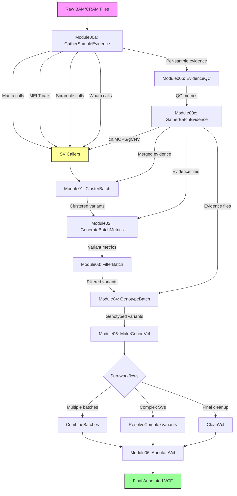

# GATK-SV Pipeline Overview

## Summary

The GATK-SV (Genome Analysis Toolkit for Structural Variants) pipeline contains **126 WDL workflow files** that implement a comprehensive structural variant discovery and genotyping pipeline. These workflows are organized into modular components that can be executed sequentially or independently.

## Pipeline Statistics

- **Total WDL files**: 126
- **Main pipeline workflows**: 3 (Batch, Phase1, Single Sample)
- **Core modules**: 7 (Module00a-c, Module01-06)
- **Supporting workflows**: ~116 (utilities, sub-workflows, QC, metrics)

## Pipeline Architecture

### Main Workflows

1. **GATKSVPipelineBatch.wdl** - Master workflow for cohort/batch analysis
2. **GATKSVPipelinePhase1.wdl** - Runs modules 00-03 for initial discovery
3. **GATKSVPipelineSingleSample.wdl** - Optimized workflow for single sample analysis

### Module Organization

The pipeline follows a sequential module structure:

| Module | Name | Purpose | Key Outputs |
|--------|------|---------|-------------|
| 00a | GatherSampleEvidence | Collects SV evidence per sample | PE, SR, RD, BAF files |
| 00b | EvidenceQC | Quality control of evidence | QC metrics, plots |
| 00c | GatherBatchEvidence | Merges evidence across batch | Merged evidence files |
| 01 | ClusterBatch | Clusters raw SV calls | Clustered VCFs |
| 02 | GenerateBatchMetrics | Tests variants against evidence | Variant metrics |
| 03 | FilterBatch | Filters variants by quality | Filtered VCFs |
| 04 | GenotypeBatch | Re-genotypes filtered variants | Genotyped VCFs |
| 05 | MakeCohortVcf | Combines batches, resolves complex SVs | Cohort VCF |
| 06 | AnnotateVcf | Adds functional annotations | Annotated VCF |

## Data Flow Diagram

## Evidence Types Collected

1. **PE (Paired-End)**: Discordant read pairs indicating SVs
2. **SR (Split Reads)**: Reads split across SV breakpoints
3. **RD (Read Depth)**: Coverage changes indicating CNVs
4. **BAF (B-Allele Frequency)**: Allele frequency shifts

## SV Callers Integrated

- **Manta**: Detects all SV types using paired-end and split-read evidence
- **MELT**: Specializes in Mobile Element Insertions (MEIs)
- **Scramble**: Detects mobile element insertions
- **Wham**: Uses multiple signals for SV detection
- **cn.MOPS**: Copy number detection in targeted sequencing
- **gCNV**: Germline CNV caller using a cohort approach

## Key Features

### Modular Design
- Each module can run independently with proper inputs
- Allows for partial pipeline execution and debugging
- Facilitates custom pipeline configurations

### Comprehensive QC
- Sample-level QC (Module00b)
- Batch-level QC (Module00c)
- Variant-level QC (Module02)
- Final VCF QC (MainVcfQc workflow)

### Complex SV Resolution
- Dedicated workflows for complex variants
- Specialized handling of inversions, translocations, and complex rearrangements
- CPX (complex) variant reconstruction

### Scalability
- Designed for cohort-scale analysis (100s to 1000s of samples)
- Batch processing to manage computational resources
- Cloud-optimized for Terra/Google Cloud Platform

## Output Files

The pipeline produces:
- **VCF files**: Containing discovered and genotyped SVs
- **QC reports**: Sample and batch quality metrics
- **Evidence files**: Intermediate files for debugging/reanalysis
- **Annotation files**: Functional impact predictions

## Workflow Conversion Impact

When converting to CWL, each of the 126 WDL workflows will generate:
- A corresponding CWL workflow file
- Associated CWL tool definitions for command-line steps
- Input parameter files (YAML format)
- Documentation for each converted workflow

This modular structure ensures that the converted CWL workflows maintain the same flexibility and scalability as the original WDL implementation.